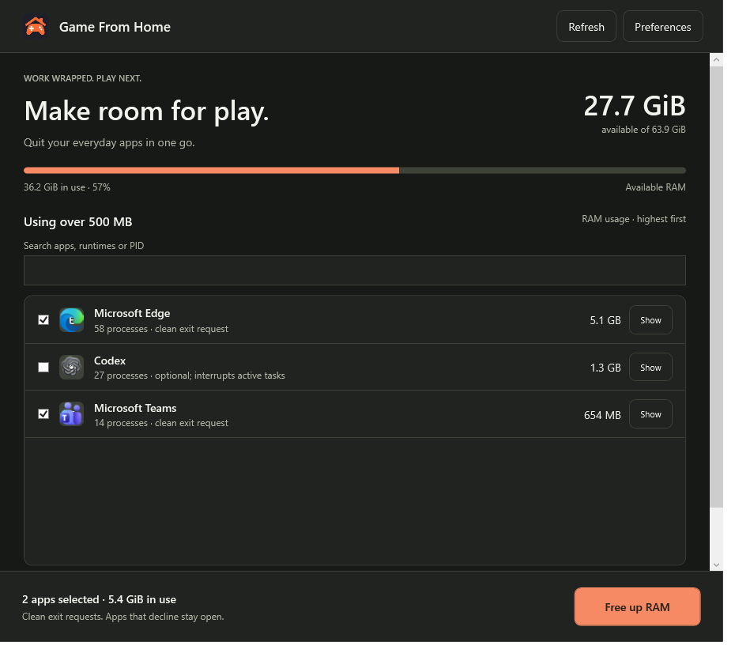

<p align="center"></p>
<h1 align="center">Game From Home</h1>
<p align="center"><strong>Make room for play.</strong><br>Clean app exits. More available RAM.</p>
<p align="center"><a href="https://github.com/kmanan/game-from-home/releases/tag/v0.2.2">Download for Windows</a> · <a href="docs/ARCHITECTURE.md">How it works</a> · <a href="docs/SPEC.md">Product spec</a> · <a href="LICENSE">MIT license</a></p>

Game From Home is a small, on-demand Windows utility for the moment you want to stop working and start playing. See which everyday apps are using RAM, close a remembered selection with one button, and see the measured change in available memory.

**Discord stays open. Codex is your choice.** Codex starts unchecked and closes last when selected. Apps that decline a clean exit are left running and reported honestly.



## What it does

- Shows only apps with a supported clean-exit method using **more than 500 MB** (500,000,000 bytes), largest first. App processes are grouped before applying the threshold.
- Entries below the threshold are omitted from both the list and one-click cleanup, even if previously selected. Discovery still inspects the full process inventory to verify exits.
- Search by name, runtime, parent process, PID, or executable path.
- Uses a virtualized list so hundreds of processes do not require hundreds of rendered rows.
- Remembers the apps you choose to close.
- Requests cooperative shutdown through Windows, with forced termination disabled.
- Identifies the default-profile claude-mem worker and uses its own local shutdown endpoint after verifying its identity.
- Checks that app processes actually exited, including tracked helpers.
- Reports available RAM before and after, including zero or negative changes.
- Supports a one-click shortcut or Stream Deck launcher.
- Exits completely when finished. No service, startup task, resident hotkey listener, account, or telemetry.

It does not manage game libraries, change priorities, stop drivers, purge caches, or promise higher FPS.

## Download and run

Get **[GameFromHome-windows-x64.zip](https://github.com/kmanan/game-from-home/releases/download/v0.2.2/GameFromHome-windows-x64.zip)** from the [v0.2.2 release](https://github.com/kmanan/game-from-home/releases/tag/v0.2.2). Extract the complete folder and open `GameFromHome.exe`.

This initial build requires **Windows x64 and the .NET 9 Desktop Runtime**. It has no installer, but it is not fully self-contained: companion files must stay together, and settings live in `%LOCALAPPDATA%\GameFromHome`. The runtime is available from [Microsoft](https://dotnet.microsoft.com/en-us/download/dotnet/9.0). This release is unsigned.

Review the selected apps and press **Free up RAM**. The selection is remembered. New or changed installations require review before entering the saved selection.

### One-click shortcut

After approving a selection, **Preferences → Create one-click shortcut** creates a launcher beside the app. Stream Deck can also launch:

```text
GameFromHome.exe --run-profile default --show-result
```

With no saved selection, this opens the review screen. Successful results can close automatically after eight seconds; partial results remain visible.

## App compatibility

| App | Current behavior |
|---|---|
| Microsoft Edge, Teams, Zoom, Cursor | Known installation identities; cooperative Windows exit requests |
| WhatsApp, ChatGPT, Claude | Known installation rules; more distribution/version coverage needed |
| Codex | Selectable; unchecked until approved; closes last |
| Discord | Always protected; excluded from the cleanup list |
| Other desktop apps with a visible window | Discovered automatically; opt-in cooperative exit |
| claude-mem worker | Bun/Node worker identified from command, PID file, and same-user identity; app-specific shutdown |
| Other Bun, Node, Python and background processes | Excluded from the cleanup list unless a supported app-specific exit method is available |
| System and service processes | Excluded from the cleanup list, including Memory Compression |
| Drivers, kernel pools, caches, inaccessible memory | Included in overall system usage; not all attributable to individual rows |

`ChatGPT.exe` inside a Codex package is identified as **Codex**. Generic Node, Bun, Python, shell, and WSL processes without a supported clean-exit method are excluded from the cleanup list. App-owned Codex runtime helpers are grouped through verified ancestry and the Codex installation path. A standalone Codex CLI remains a separate runtime. Hover a row for executable paths and process IDs.

**v0.2.2 keeps the cleanup list focused on actionable apps over 500 MB.** Controlled tests cover normal apps, hidden apps, vetoed shutdowns, protected identities, and remaining children. Individual versions of every third-party app have not been closed as part of validation. Each app controls how it handles Windows shutdown requests; Game From Home checks and reports the outcome. It does not provide universal session backup or restore.

## How clean exit works

Windows Restart Manager is called with `flags = 0`. Exact process instances are registered using PID and creation time. No files or services are registered, and the affected-process list is checked before shutdown. Forced termination is disabled. The program never asks Windows to reboot or restarts apps afterward.

An app may decline or fail to finish. A five-second observation checks original process instances, tracked helpers, and relaunches. A closed window alone does not count as success.

The claude-mem adapter supports the default `~/.claude-mem/worker.pid` profile and `worker-service.cjs` layout. It validates the PID/creation time, Bun/Node command, TCP listener ownership, and `/api/health` PID before POSTing `/api/admin/shutdown`. Redirects and proxies are disabled. Other versions or custom data directories are excluded from cleanup if not recognized. Hooks may start a stopped worker again. There is no force-kill fallback.

Per-app values are **private working set**, not private commit or summed shared working sets. Windows-managed and unsupported processes contribute to overall system usage but do not appear in the cleanup list. Full process discovery is retained internally for exit verification. The result is the signed difference between median available-memory samples. Other Windows activity can affect this change, so selected usage is not guaranteed savings.

## Build

The repository pins .NET SDK **9.0.318**. It uses C#, WPF, Win32 interop, and no external NuGet packages.

```powershell
./build.ps1
./build.ps1 -Test
```

The second command runs the disposable Windows fixture suite. Teardown may terminate only a test-owned refusing fixture; production code has no force-kill path. The included CI template builds every project and runs checks that do not need interactive fixtures. It is not yet active in GitHub Actions. See [validation results](docs/VALIDATION.md). **35 regression checks passed** for the underlying v0.2.0 shutdown implementation; subsequent display-only changes are checked separately.

```text
src/GameFromHome/           Native UI, icons, preferences, shortcuts
src/GameFromHome.Core/      Discovery, identity, RAM, shutdown, verification
tests/GameFromHome.Tests/   Regression harness
tests/GameFromHome.Fixture/ Disposable Windows test applications
docs/                      Design, architecture, validation, social assets
```

## Updating from v0.1.0

Replace the extracted app files with this release. Existing profiles are retained, but the expanded installation fingerprint requires one review of previously selected apps. Codex and newly discovered apps are not silently added to your cleanup.

## Roadmap

- Move to .NET 10 LTS before .NET 9 support ends on 10 November 2026.
- Broader Store-app and third-party version validation.
- Better handling for apps that decline cooperative shutdown.
- Full light-theme and dynamic high-contrast polish.
- Signed and self-contained distribution.

## Sharing

The custom GitHub Open Graph card lives at [`docs/assets/social-preview.png`](docs/assets/social-preview.png). GitHub repository **Settings → Social preview** must use that image. Committing it or adding HTML meta tags to a README does not configure GitHub's shared-link preview.

## License

[MIT](LICENSE). Generated app artwork and the social card are included; see [asset notes](docs/ASSETS.md). Third-party app icons in the screenshot belong to their respective owners.
